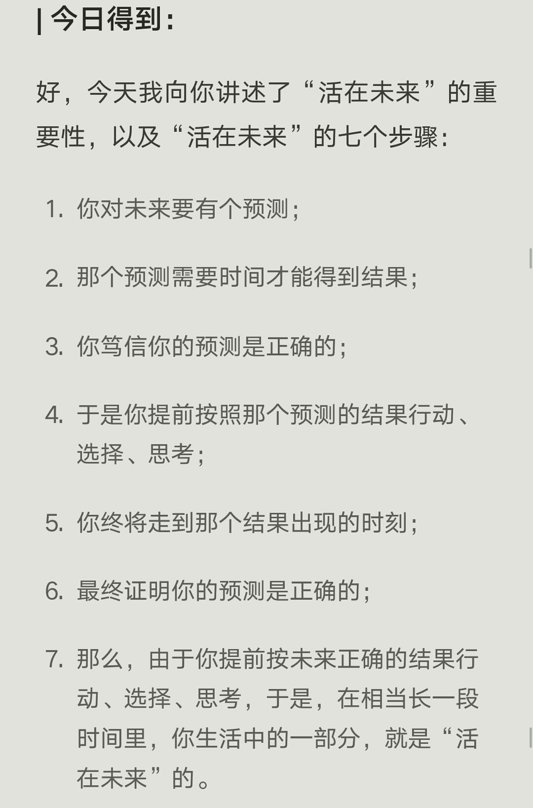
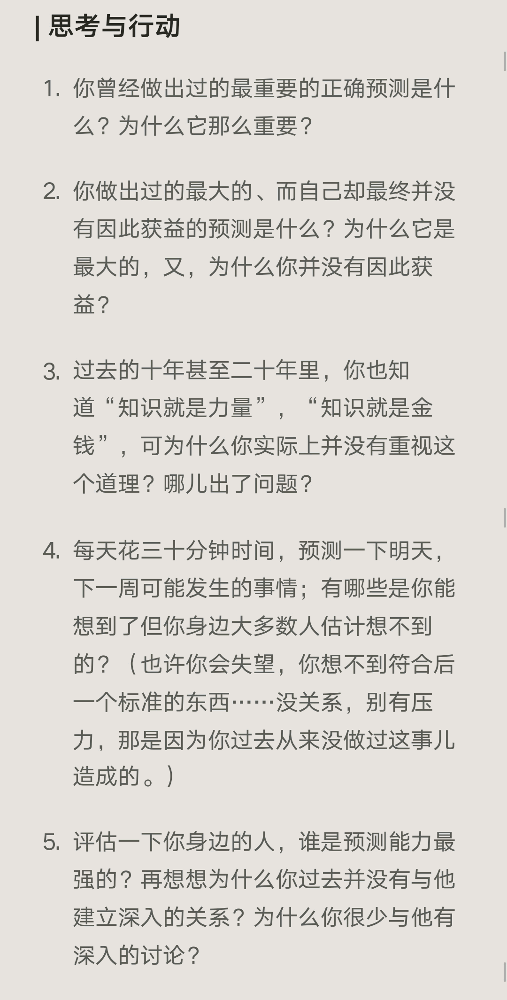

# FINANCIAL FREEDOM_Reading Notes

### “活在未来”vs“活在当下”

#### 活在未来指的是我们的思维活在未来，而身体只能活在当下。活在当下（思维）：被困在永恒的当下。
#### 投资，用现在的资源换去未来的资源。
#### 知识就是金钱，时间就是力量，尽管我们从小就知道知识就是力量，可我们没有重视起来。只是知道，可就是没有做到，如同倾听是对别人表达关注的具体表现。大部分人不懂得倾听，是没有意识到倾听的重要性，或者不愿为此付出努力，知识也是；如投资一样，只会写投资二字，却不知道投资是什么？为什么要投资？更何况做到投资呢。生活何尝不是投资呢。
#### 活在未来的东西，你一定要笃信，并且践行。

 
